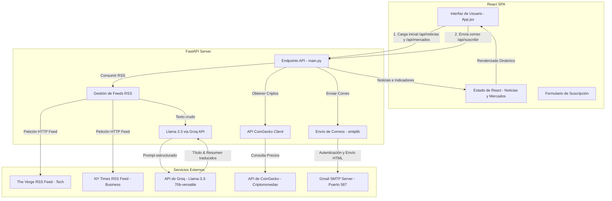

# Walkthrough de Botbi Finance 🤖💼

Este documento proporciona una guía detallada y un análisis técnico completo del proyecto **Botbi Finance**, desarrollado para el Hackathon.

## Índice
1. [Descripción General](#1-descripción-general)
2. [Arquitectura del Sistema](#2-arquitectura-del-sistema)
3. [Componente: Backend (FastAPI)](#3-componente-backend-fastapi)
   - [Modelos de Datos](#a-modelos-de-datos)
   - [Procesamiento de Noticias con Groq AI](#b-procesamiento-de-noticias-con-groq-ai)
   - [Servicio de Correo VIP (SMTP)](#c-servicio-de-correo-vip-smtp)
   - [Integración de Mercados Financieros](#d-integración-de-mercados-financieros)
   - [Endpoints de la API](#e-endpoints-de-la-api)
4. [Componente: Frontend (React + Vite + Tailwind CSS)](#4-componente-frontend-react-vite-tailwind-css)
   - [Estructura y Componentes](#a-estructura-y-componentes)
   - [Animaciones y Efectos Visuales](#b-animaciones-y-efectos-visuales)
   - [Flujos de Estado Clave](#c-flujos-de-estado-clave)
5. [Guía de Configuración y Despliegue](#5-guía-de-configuración-y-despliegue)
   - [Variables de Entorno](#a-variables-de-entorno)
   - [Instalación del Backend](#b-instalación-del-backend)
   - [Instalación del Frontend](#c-instalación-del-frontend)

---

### 1. Descripción General
**Botbi Finance** es una plataforma web inteligente de información financiera y tecnológica. El sistema automatiza la recolección de noticias globales de fuentes prestigiosas, utiliza Inteligencia Artificial de última generación para traducirlas y resumirlas en español con un enfoque profesional y analítico, y presenta indicadores en tiempo real de los principales mercados financieros (acciones tradicionales y criptomonedas). Además, ofrece un servicio de newsletter VIP automatizado para enviar por correo electrónico las novedades más críticas del día de manera directa y atractiva.

---

### 2. Arquitectura del Sistema
El proyecto sigue una arquitectura desacoplada clásica:
- **Frontend**: Single Page Application (SPA) responsiva construida con **React (Vite)**, estilizada usando **Tailwind CSS** para un diseño moderno "dark-mode glassmorphism", animada con **Framer Motion** e íconos de **Lucide React**.
- **Backend**: API REST de alto rendimiento construida con **FastAPI (Python)**, que procesa feeds RSS externos, integra la API de inferencia de **Groq** para procesamiento de lenguaje natural y envía correos mediante el protocolo **SMTP**.

Aquí tienes el diagrama de flujo y relaciones de la aplicación:



---

### 3. Componente: Backend (FastAPI)
El backend está definido completamente en [backend/main.py](file:///Users/nolohmijares/Documents/HackathonBotbi/backend/main.py).

#### A. Modelos de Datos
Utiliza **Pydantic** para validar las entradas de la API:
- `Suscriptor`: Valida que el email recibido en el endpoint `/api/suscribir` sea una cadena de texto válida.

#### B. Procesamiento de Noticias con Groq AI
La función `consultar_groq(texto_noticia, categoria)` se encarga del procesamiento inteligente:
- **Modelo Utilizado**: `llama-3.3-70b-versatile` a través de la API de Groq, configurado con una temperatura de `0.5` para garantizar respuestas consistentes y precisas.
- **Instrucciones del Prompt (System/User)**:
  - Traducir la noticia de entrada al español con un estilo financiero profesional.
  - Generar un título impactante de máximo 12 palabras.
  - Crear un resumen detallado que explique el contexto y las implicaciones financieras de la noticia (entre 60 y 80 palabras).
  - Responder bajo un formato estricto: `TITULO: [Texto]` y `RESUMEN: [Texto]`.
- **Análisis de Respuesta**: El backend limpia los caracteres especiales (`*`) y divide la respuesta para extraer las variables limpias `titulo_final` y `resumen_final`. Si ocurre un fallo en la API, se realiza un fallback amigable mostrando los datos originales de la fuente.

#### C. Servicio de Correo VIP (SMTP)
La función `enviar_correo_vip(destinatario, noticia_tech, noticia_biz)` gestiona la distribución de newsletters:
- Construye un correo con formato **MIMEMultipart** (HTML).
- El cuerpo del correo es un diseño HTML responsivo estilizado en colores azul rey e índigo, con bloques dedicados para Tecnología y Negocios, incluyendo enlaces directos a las fuentes originales.
- Utiliza la biblioteca estándar `smtplib` para conectarse a `smtp.gmail.com` en el puerto `587` con cifrado **TLS** (`starttls()`).
- Se autentica con un correo emisor (`milerrores25@gmail.com`) y una Contraseña de Aplicación de Google segura provista por las variables de entorno.

#### D. Integración de Mercados Financieros
El endpoint `/api/mercados` combina dos tipos de datos:
1. **Acciones Tradicionales (Fijas)**: Un arreglo estático de las 10 empresas tecnológicas más grandes (AAPL, MSFT, GOOGL, AMZN, NVDA, TSLA, META, BRK-B, LLY, AVGO) con precios simulados y cambios porcentuales de las últimas 24 horas.
2. **Criptomonedas (Tiempo Real)**: La función `obtener_top_criptos_real()` realiza una consulta HTTP a la API pública de **CoinGecko** para obtener el top 10 de monedas virtuales ordenadas por capitalización de mercado, recuperando su símbolo, precio actual en USD, porcentaje de cambio y URL de logotipo.

#### E. Endpoints de la API
- **`GET /api/noticias`**: Escanea las noticias recientes de The Verge y NY Times (6 de cada una), las procesa con Groq y devuelve una lista de noticias unificada con IDs únicos (`uuid4`).
- **`GET /api/mercados`**: Devuelve la lista unificada de acciones y criptomonedas.
- **`POST /api/suscribir`**: Recibe el email del suscriptor, obtiene las noticias más recientes y envía el correo VIP con la mejor noticia de tecnología y de negocios del día. Si el envío SMTP real falla por falta de credenciales válidas, simula la entrega de forma segura para no romper la experiencia de usuario del Hackathon.

---

### 4. Componente: Frontend (React + Vite + Tailwind CSS)
El frontend está alojado en la carpeta `frontend/` y se organiza mediante un archivo orquestador principal [frontend/src/App.jsx](file:///Users/nolohmijares/Documents/HackathonBotbi/frontend/src/App.jsx) que consume componentes reutilizables y modulares creados dentro de [frontend/src/components/](file:///Users/nolohmijares/Documents/HackathonBotbi/frontend/src/components).

La aplicación está modularizada en los siguientes componentes clave dentro de la carpeta `src/components/`:
1. **[Navbar.jsx](file:///Users/nolohmijares/Documents/HackathonBotbi/frontend/src/components/Navbar.jsx)**: Barra de navegación flotante con efecto *backdrop-blur* (glassmorphism) y enlaces rápidos a las secciones principales.
2. **[Hero.jsx](file:///Users/nolohmijares/Documents/HackathonBotbi/frontend/src/components/Hero.jsx)**: Encabezado visual con gradiente radial de fondo, título con gradiente cromático animado de texto y subtítulo explicativo de la plataforma.
3. **[MarketTicker.jsx](file:///Users/nolohmijares/Documents/HackathonBotbi/frontend/src/components/MarketTicker.jsx)**: Dos cintas deslizantes horizontales infinitas. Una para el mercado accionario y otra para criptomonedas (con sus respectivos logotipos circulares de CoinGecko y optimizaciones de claves React exclusivas).
4. **[NewsCard.jsx](file:///Users/nolohmijares/Documents/HackathonBotbi/frontend/src/components/NewsCard.jsx)**: Tarjeta responsiva que muestra el contenido de cada noticia procesada, con colores diferenciados por categoría (Tecnología en Azul Rey, Negocios en Índigo), fecha y enlace interactivo de lectura.
5. **[Newsletter.jsx](file:///Users/nolohmijares/Documents/HackathonBotbi/frontend/src/components/Newsletter.jsx)**: Formulario interactivo responsivo de suscripción con manejo automático de estados de entrega (idle, enviando, éxito o error).
6. **[ErrorMessage.jsx](file:///Users/nolohmijares/Documents/HackathonBotbi/frontend/src/components/ErrorMessage.jsx)**: Tarjeta visual de aviso en caso de fallos de red con el backend, que incluye un botón interactivo de reintento.

#### B. Animaciones y Efectos Visuales
- **Marquee Animado**: Configurado a través de Tailwind CSS en [tailwind.config.js](file:///Users/nolohmijares/Documents/HackathonBotbi/frontend/tailwind.config.js) mediante la animación `marquee: 'marquee 25s linear infinite'` y los keyframes que desplazan el contenedor del `0%` al `-50%` en el eje X, permitiendo una experiencia de scroll horizontal infinito perfectamente fluida.
- **Framer Motion**:
  - Animación de entrada (`initial` y `animate`) para el título y descripción de la sección Hero.
  - Animación por tarjeta de noticia (`whileInView` y `whileHover`) para escalar el componente al entrar a la pantalla e inclinarlo/desplazarlo hacia arriba (`y: -8`) al hacer hover, otorgando dinamismo a la interfaz.
- **Efectos CSS y Gradientes**: Uso extensivo de clases como `bg-clip-text text-transparent bg-gradient-to-r`, `backdrop-blur-md` y sombras difuminadas con colores de acento (`shadow-blue-500/25`, `border-blue-500/50`).

#### C. Flujos de Estado Clave
- **Carga de Datos Concurrente (`useEffect`)**: En el montaje del componente, se realizan peticiones asíncronas concurrentes usando `Promise.all` hacia el backend en `http://127.0.0.1:8000/api/noticias` y `http://127.0.0.1:8000/api/mercados`. Esto disminuye la latencia de red.
- **Manejo de Estados de Error**: Si las APIs fallan o el backend está desconectado, se activa un estado de error (`setError`) y se renderiza condicionalmente el componente `ErrorMessage`, permitiendo al usuario volver a intentar la conexión de inmediato sin recargar toda la pestaña.
- **Formulario de Suscripción**: Controlado de manera interna por el componente autónomo `Newsletter.jsx`, manejando los estados visuales correspondientes.

---

### 5. Guía de Configuración y Despliegue

#### A. Variables de Entorno
Crea un archivo `.env` dentro de la carpeta `backend/` con la siguiente estructura:
```env
API_KEY_GROQ=tu_clave_de_api_de_groq_aqui
CONTRA_APLICACION=tu_contraseña_de_aplicacion_gmail_aquí
```
> [!NOTE]
> La contraseña de aplicación de Gmail no es tu contraseña normal de correo. Debes generarla desde la configuración de seguridad de tu cuenta de Google (bajo "Contraseñas de aplicaciones" en la sección de Verificación en 2 pasos).

#### B. Instalación del Backend
1. Navega a la carpeta del backend:
   ```bash
   cd backend
   ```
2. Si no tienes el entorno virtual activo, créalo e instálalo:
   ```bash
   python3 -m venv venv
   source venv/bin/activate
   ```
3. Instala las dependencias requeridas:
   ```bash
   pip install fastapi uvicorn requests feedparser pydantic python-dotenv
   ```
4. Inicia el servidor de desarrollo:
   ```bash
   uvicorn main:app --reload
   ```
   El backend correrá en `http://127.0.0.1:8000`.

#### C. Instalación del Frontend
1. Abre una nueva terminal y navega a la carpeta del frontend:
   ```bash
   cd frontend
   ```
2. Instala los paquetes de Node:
   ```bash
   npm install
   ```
3. Ejecuta el servidor de desarrollo:
   ```bash
   npm run dev
   ```
   La aplicación web estará disponible en `http://localhost:5173`.
